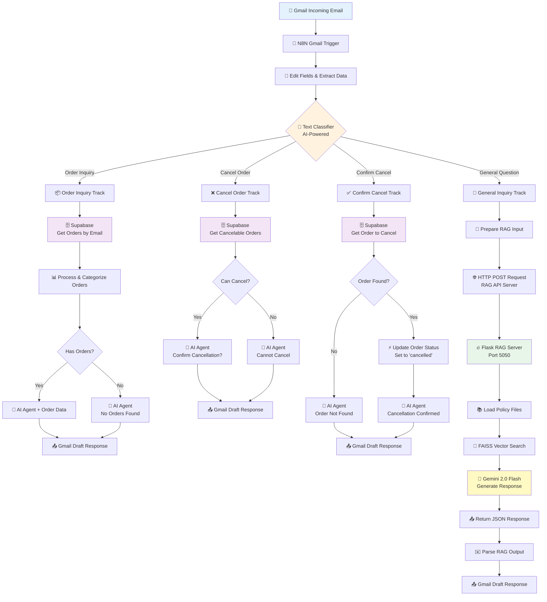

<<<<<<< HEAD
# ⚽ Caster Sport - نظام الدعم الذكي | Smart Customer Support System

> **نظام متكامل للدعم الفني** يجمع بين N8N Workflow و RAG API و Supabase لإدارة استفسارات العملاء تلقائياً  
> **Complete Customer Support System** combining N8N Workflow automation, RAG API, and Supabase for intelligent customer service

---

## 🏗️ System Architecture | بنية النظام



---

## ✨ Key Features | المميزات الرئيسية

### 🎯 Core Capabilities
- ✅ **Gmail Integration** - يستقبل ويرد على الإيميلات تلقائياً
- ✅ **AI-Powered Classification** - تصنيف ذكي للاستفسارات (4 أنواع)
- ✅ **Supabase Order Management** - إدارة الطلبات والإلغاءات
- ✅ **RAG for General Questions** - إجابات ذكية من سياسات الشركة
- ✅ **Multi-Language Support** - عربي وإنجليزي تلقائياً
- ✅ **Automated Workflows** - 4 مسارات عمل ذكية
- ✅ **OpenRouter AI Models** - GPT-4 Turbo للذكاء الاصطناعي

### 📊 Workflow Tracks | مسارات العمل

| Track | الوظيفة | AI Agent | Database |
|-------|---------|----------|----------|
| **Order Inquiry** 📦 | الاستعلام عن الطلبات | ✅ | Supabase |
| **Cancel Order** ❌ | طلب إلغاء طلب | ✅ | Supabase |
| **Confirm Cancel** ✅ | تأكيد الإلغاء | ✅ | Supabase Update |
| **General Inquiry** 💬 | أسئلة عامة | RAG API | Policy Files |

---

## 🚀 Quick Start | البدء السريع

### 📋 Prerequisites | المتطلبات

#### Required Software | البرامج المطلوبة
- 💻 **Windows 10+**
- 🐍 **Python ≥ 3.9**
- 📦 **Node.js & npm** (for N8N)
- 🌐 **Internet Connection**

#### Required Accounts | الحسابات المطلوبة
- 🔑 **OpenRouter API Key** (for AI models)
- 📧 **Gmail Account** (with App Password)
- 🗄️ **Supabase Account** (for database)

---

## 🔧 Setup Guide | دليل الإعداد

### Part 1️⃣: Install N8N

```bash
# Install N8N globally
npm install -g n8n

# Start N8N
n8n start

# N8N will be available at: http://localhost:5678
```

---

### Part 2️⃣: Setup Supabase Database

1. **Create Supabase Project** at [supabase.com](https://supabase.com)

2. **Create `orders` Table**:
```sql
CREATE TABLE orders (
  id UUID PRIMARY KEY DEFAULT gen_random_uuid(),
  order_number VARCHAR(50) UNIQUE NOT NULL,
  customer_email VARCHAR(255) NOT NULL,
  customer_name VARCHAR(255),
  phone_number VARCHAR(50),
  status VARCHAR(50) NOT NULL DEFAULT 'pending',
  total_amount DECIMAL(10, 2),
  items JSONB,
  created_at TIMESTAMP DEFAULT NOW()
);

-- Create index for faster email queries
CREATE INDEX idx_orders_email ON orders(customer_email);
CREATE INDEX idx_orders_status ON orders(status);
```

3. **Get Supabase Credentials**:
   - Go to **Project Settings** → **API**
   - Copy **Project URL**
   - Copy **anon/public API key**

---

### Part 3️⃣: Setup Gmail

1. **Enable 2-Factor Authentication** on your Gmail account

2. **Create App Password**:
   - Go to [myaccount.google.com/apppasswords](https://myaccount.google.com/apppasswords)
   - Generate a new app password
   - Save it securely

3. **Enable Gmail API**:
   - Go to [console.cloud.google.com](https://console.cloud.google.com)
   - Create/select a project
   - Enable **Gmail API**
   - Create **OAuth 2.0 credentials**
   - Download credentials JSON

---

### Part 4️⃣: Import & Configure N8N Workflow

1. **Open N8N** at `http://localhost:5678`

2. **Import Workflow**:
   - Click **Workflows** → **Import from File**
   - Select: `N8N/Main Workflow - V4.json`

3. **Configure Credentials**:

   #### Gmail OAuth2:
   - Click **Gmail Trigger** node
   - Add **Gmail OAuth2** credential
   - Upload your OAuth credentials JSON
   - Authorize access

   #### OpenRouter API:
   - Click any **OpenRouter Chat Model** node
   - Add **OpenRouter API** credential
   - Enter your API key from [openrouter.ai](https://openrouter.ai)

   #### Supabase API:
   - Click any **Supabase** node
   - Add **Supabase** credential
   - Enter Project URL and API key

4. **Update RAG API URL**:
   - Find **HTTP Request (RAG)** node
   - Update URL to: `http://localhost:5050/ask`
   - Or use ngrok URL for remote access

5. **Activate Workflow**:
   - Toggle **Active** switch to ON
   - Workflow will start monitoring Gmail

---

### Part 5️⃣: Setup RAG API Server

#### Method 1: One-Click Setup ⭐ (Recommended)

```bash
# Navigate to RAG folder
cd "Final project\RAG"

# Double-click run.bat or run:
.\run.bat
```

#### Method 2: Manual Setup

```bash
# 1. Navigate to RAG folder
cd "Final project\RAG"

# 2. Create .env file
copy .env.example .env

# 3. Edit .env and add your OpenRouter API key
# OPENROUTER_API_KEY=sk-or-v1-xxxxx

# 4. Install Python dependencies
py -m pip install flask langchain-core langchain-community ^
    langchain-openai langchain-huggingface langchain-text-splitters ^
    faiss-cpu sentence-transformers python-dotenv

# 5. Run the server
py rag_server.py
```

#### Verify RAG Server:
```bash
# Open browser and visit:
http://localhost:5050/health

# Expected response:
{"status": "ok"}
```

---

## 🔌 RAG API Reference | مرجع واجهة RAG

### Endpoint: POST /ask

**Request:**
```json
{
  "question": "What is your return policy?",
  "emailFrom": "customer@example.com",
  "emailSubject": "Return inquiry",
  "chatId": ""
}
```

**Response:**
```json
{
  "answer": "Dear Customer,\n\nThank you for contacting Caster Sport...",
  "emailSubject": "Re: Return inquiry",
  "emailFrom": "customer@example.com",
  "chatId": "",
  "error": ""
}
```

### Request Fields

| Field | Type | Required | Description |
|-------|------|----------|-------------|
| `question` | string | ✅ Yes* | Customer question text |
| `emailBody` | string | ✅ Yes* | Alternative to question |
| `emailFrom` | string | ⬜ Optional | Customer email address |
| `emailSubject` | string | ⬜ Optional | Email subject line |
| `chatId` | string | ⬜ Optional | Conversation ID |

*At least one of `question` or `emailBody` is required

---

## 📂 Policy Files | ملفات السياسات

Located in `RAG/policies/`:

| File | Content | استخدامه |
|------|---------|-----------|
| `returns_refunds.txt` | Return & Refund Policy | سياسة الإرجاع والاسترداد |
| `shipping_delays.txt` | Shipping Delays | تأخيرات الشحن |
| `damaged_goods.txt` | Damaged Items Policy | البضائع التالفة |
| `cancel_shipment.txt` | Cancellation Policy | إلغاء الشحنات |
| `exchange_policy.txt` | Exchange Policy | سياسة الاستبدال |
| `password_account.txt` | Account Management | إدارة الحسابات |
| `general_contact.txt` | Contact Information | معلومات التواصل |

### Adding New Policies | إضافة سياسات جديدة

1. Create a new `.txt` file in `RAG/policies/`
2. Write policy content in plain text (Arabic or English)
3. Restart RAG server: `py rag_server.py`

---

## 🔄 How It Works | كيف يعمل النظام

### Complete Flow | المسار الكامل

1. **Email Arrives** 📧
   - Customer sends email to your Gmail
   - N8N Gmail Trigger detects new email

2. **Data Extraction** 📝
   - Extract: email body, sender, subject
   - Prepare data for classification

3. **AI Classification** 🤖
   - Text Classifier analyzes email content
   - Categorizes into 4 types:
     - **Order Inquiry**: Customer asking about their order
     - **Cancel Order**: Customer wants to cancel
     - **Confirm Cancel**: Customer confirms cancellation
     - **General Inquiry**: Other questions

4. **Route to Appropriate Track** 🛤️

   ### Track A: Order Inquiry 📦
   - Query Supabase for customer's orders
   - Process and categorize orders (pending, shipped, delivered, cancelled)
   - AI Agent generates personalized response with order details
   - Create Gmail draft

   ### Track B: Cancel Order ❌
   - Check if customer has cancelable orders (status='pending')
   - If yes: AI Agent asks for confirmation
   - If no: AI Agent explains order cannot be cancelled
   - Create Gmail draft

   ### Track C: Confirm Cancel ✅
   - Find the specific order to cancel
   - Update order status to 'cancelled' in Supabase
   - AI Agent confirms cancellation
   - Create Gmail draft

   ### Track D: General Inquiry 💬
   - Prepare question for RAG API
   - Send HTTP POST to Flask server (port 5050)
   - RAG server:
     - Loads policy files
     - Searches FAISS vector store
     - Generates answer using Gemini 2.0
   - Parse RAG response
   - Create Gmail draft

5. **Response Created** ✅
   - Gmail draft is created automatically
   - You can review and send manually
   - Or configure N8N to send automatically

---

## 🧪 Testing the System | اختبار النظام

### Test 1: Order Inquiry
Send email with body:
```
Subject: Order Status

Hello,
I would like to check the status of my order.
My email: customer@example.com

Thank you.
```

Expected: System finds orders in Supabase and responds with details.

---

### Test 2: Cancel Request
Send email with body:
```
Subject: Cancel Order

Hi,
I need to cancel my order #12345.

Thanks.
```

Expected: System checks if order is cancelable and asks for confirmation.

---

### Test 3: Confirm Cancellation
Send email with body:
```
Subject: Re: Cancel Order

Yes, please cancel order #12345.
I confirm the cancellation.
```

Expected: System updates order status to 'cancelled' and confirms.

---

### Test 4: General Question
Send email with body:
```
Subject: Return Policy

Hello,
What is your return policy?

Thank you.
```

Expected: RAG API retrieves policy from files and generates response.

---

### Test 5: RAG API Direct Test

**PowerShell:**
```powershell
$body = @{
    question = "ما هي سياسة الشحن؟"
    emailFrom = "test@example.com"
} | ConvertTo-Json

Invoke-RestMethod -Method Post `
  -Uri "http://localhost:5050/ask" `
  -Body $body `
  -ContentType "application/json"
```

**CMD:**
```cmd
curl -X POST http://localhost:5050/ask ^
  -H "Content-Type: application/json" ^
  -d "{\"question\": \"What is your shipping policy?\"}"
```

---

## 🗄️ Database Schema | مخطط قاعدة البيانات

### Orders Table

| Column | Type | Description |
|--------|------|-------------|
| `id` | UUID | Unique order ID (Primary Key) |
| `order_number` | VARCHAR(50) | Human-readable order number |
| `customer_email` | VARCHAR(255) | Customer email address |
| `customer_name` | VARCHAR(255) | Customer full name |
| `phone_number` | VARCHAR(50) | Customer phone |
| `status` | VARCHAR(50) | Order status (pending, shipped, delivered, cancelled) |
| `total_amount` | DECIMAL(10,2) | Order total price |
| `items` | JSONB | Order items (JSON format) |
| `created_at` | TIMESTAMP | Order creation time |

### Sample Order Data

```json
{
  "order_number": "CS-2024-001",
  "customer_email": "customer@example.com",
  "customer_name": "Ahmed Ali",
  "phone_number": "+966501234567",
  "status": "pending",
  "total_amount": 299.99,
  "items": [
    {
      "product": "Football Jersey",
      "size": "L",
      "quantity": 2,
      "price": 149.99
    }
  ]
}
```

---

## ⚙️ Configuration | الإعدادات

### RAG Model Settings

Located in `rag_server.py`:

```python
# LLM Model
MODEL = "google/gemini-2.0-flash-001"

# Text Chunking
CHUNK_SIZE = 800
CHUNK_OVERLAP = 100

# Embeddings Model
EMBEDDING_MODEL = "sentence-transformers/all-MiniLM-L6-v2"

# Vector Store
VECTOR_STORE = "FAISS"
```

### N8N Workflow Settings

- **Text Classifier Model**: `openai/gpt-4.1`
- **AI Agent Temperature**: `0.6`
- **Polling Interval**: N8N default (checks Gmail every minute)

---

## 🐛 Troubleshooting | حل المشاكل

### Common Issues | المشاكل الشائعة

| Problem | الحل | Solution |
|---------|------|----------|
| **N8N workflow not triggering** | تحقق من<br/>✅ Gmail credentials<br/>✅ Workflow is Active<br/>✅ Gmail API enabled | Check<br/>✅ Gmail credentials<br/>✅ Workflow is Active<br/>✅ Gmail API enabled |
| **Supabase connection error** | تأكد من<br/>✅ API URL correct<br/>✅ API key valid<br/>✅ Table 'orders' exists | Verify<br/>✅ API URL correct<br/>✅ API key valid<br/>✅ Table 'orders' exists |
| **RAG API not responding** | افحص<br/>✅ Server running on port 5050<br/>✅ OpenRouter API key valid<br/>✅ Policy files exist | Check<br/>✅ Server running on port 5050<br/>✅ OpenRouter API key valid<br/>✅ Policy files exist |
| **Classification not working** | راجع<br/>✅ OpenRouter credentials in N8N<br/>✅ Model name correct<br/>✅ Internet connection | Review<br/>✅ OpenRouter credentials in N8N<br/>✅ Model name correct<br/>✅ Internet connection |
| **No orders found** | تأكد من<br/>✅ Email matches in database<br/>✅ Orders exist for customer<br/>✅ Supabase query correct | Verify<br/>✅ Email matches in database<br/>✅ Orders exist for customer<br/>✅ Supabase query correct |

---

## 📁 Project Structure | هيكل المشروع

```
Final project/
├── README.md                          # 📖 هذا الملف - الدليل الكامل
│
├── N8N/
│   └── Main Workflow - V4.json       # 🔄 N8N Workflow
│                                      #    - Gmail Trigger
│                                      #    - Text Classifier  
│                                      #    - 4 AI Tracks
│                                      #    - Supabase Integration
│                                      #    - RAG API Connection
│
└── RAG/
    ├── rag_server.py                 # 🔥 Flask API Server
    │                                  #    - Policy loader
    │                                  #    - FAISS vector store
    │                                  #    - Gemini 2.0 integration
    │
    ├── run.bat                        # ⚡ Quick start script (Windows)
    │
    ├── .env.example                   # 🔑 Environment template
    ├── .env                           # 🔑 Your API keys (create this)
    │
    └── policies/                      # 📚 Policy documents (.txt)
        ├── returns_refunds.txt        #    - Returns & refunds
        ├── shipping_delays.txt        #    - Shipping delays
        ├── damaged_goods.txt          #    - Damaged items
        ├── exchange_policy.txt        #    - Exchanges
        ├── cancel_shipment.txt        #    - Cancellations
        ├── password_account.txt       #    - Account management
        └── general_contact.txt        #    - Contact info
```

---

## 🔐 Security Best Practices | أفضل ممارسات الأمان

### ⚠️ Critical Security Notes

- 🚫 **Never commit** `.env` file to Git
- 🔒 **Use App Passwords** for Gmail (not your main password)
- 🛡️ **Enable 2FA** on all accounts
- 👥 **Limit API access** to trusted services only
- 🔑 **Rotate credentials** regularly
- 📝 **Review N8N logs** for suspicious activity
- 🌐 **Use HTTPS** in production (ngrok for testing)
- 🗄️ **Secure Supabase** with Row Level Security (RLS)

### .gitignore Recommendations

```gitignore
# Environment variables
.env
*.env

# N8N local data
.n8n/

# Python
__pycache__/
*.pyc
*.pyo
venv/

# API Keys
*_credentials.json
```

---

## 📊 Tech Stack | المكدس التقني

### 🔄 Automation Layer
- **N8N** - Workflow automation platform
- **Gmail API** - Email integration
- **OpenRouter** - AI model access (GPT-4 Turbo)

### 🗄️ Database Layer
- **Supabase** - PostgreSQL database (orders management)

### 🤖 AI Layer (RAG API)
- **Python 3.9+** - Programming language
- **Flask** - Web framework
- **LangChain** - LLM orchestration
- **FAISS** - Vector similarity search
- **HuggingFace Transformers** - Embeddings
- **Sentence Transformers** - all-MiniLM-L6-v2
- **Google Gemini 2.0 Flash** - Text generation (via OpenRouter)

---

## 🎯 Use Cases | حالات الاستخدام

### ✅ Supported Scenarios | السيناريوهات المدعومة

1. **Customer checks order status** 📦
   - System retrieves all orders from Supabase
   - Categorizes by status
   - Provides detailed information

2. **Customer wants to cancel order** ❌
   - System checks if order is cancelable (status='pending')
   - Asks for confirmation
   - Prevents cancellation of shipped/delivered orders

3. **Customer confirms cancellation** ✅
   - System updates database
   - Changes order status to 'cancelled'
   - Confirms action to customer

4. **Customer has general question** 💬
   - System uses RAG API
   - Searches policy documents
   - Generates accurate, policy-based answer

5. **Multi-turn conversations** 🔄
   - System maintains context
   - Handles follow-up questions
   - Provides consistent responses

---

## 🚀 Deployment Options | خيارات النشر

### Option 1: Local Development ⚙️ (Current)
- **N8N**: `http://localhost:5678`
- **RAG API**: `http://localhost:5050`
- **Supabase**: Cloud-hosted
- **Best for**: Testing and development

### Option 2: Cloud Deployment ☁️ (Production)

#### Deploy N8N:
- **N8N Cloud**: [n8n.cloud](https://n8n.cloud) (easiest)
- **Self-hosted**: AWS, DigitalOcean, or Azure
- Use Docker for easy deployment

#### Deploy RAG API:
- **Heroku**: Easy Python app deployment
- **Railway**: Modern platform for Flask apps
- **AWS EC2**: Full control
- **Google Cloud Run**: Serverless option

#### Use ngrok for Testing:
```bash
# Expose local RAG API to internet
ngrok http 5050

# Update N8N HTTP Request node with ngrok URL
https://abc123.ngrok-free.app/ask
```

---

## 📈 Performance Tips | نصائح الأداء

### Optimize RAG API:
- ✅ Use caching for frequently asked questions
- ✅ Pre-load embeddings at startup
- ✅ Use smaller embedding models for faster responses
- ✅ Implement rate limiting to prevent abuse

### Optimize N8N Workflow:
- ✅ Use "Always Output Data" for branches
- ✅ Add error handling nodes
- ✅ Log important data for debugging
- ✅ Use conditional branches to reduce unnecessary API calls

### Optimize Supabase:
- ✅ Create indexes on frequently queried columns
- ✅ Use RLS policies for security
- ✅ Limit result sets with proper filtering
- ✅ Use connection pooling for high traffic

---

## 🔮 Future Enhancements | التطويرات المستقبلية

### Planned Features:
- 📊 **Analytics Dashboard** - Track support metrics
- 🔄 **Auto-send emails** - Remove manual review step
- 💬 **WhatsApp Integration** - Support via WhatsApp Business
- 🌍 **More Languages** - French, Spanish, etc.
- 📱 **SMS Notifications** - Order updates via SMS
- 🤝 **CRM Integration** - Salesforce, HubSpot
- 🧠 **Sentiment Analysis** - Detect angry customers
- 📈 **Performance Monitoring** - Real-time metrics

---

## 📞 Support & Help | الدعم والمساعدة

### Need Help? | تحتاج مساعدة؟

1. **Check Troubleshooting Section** above
2. **Review N8N Execution Logs** in N8N interface
3. **Test Each Component** separately:
   - RAG API: `curl http://localhost:5050/health`
   - Supabase: Check connection in N8N node
   - Gmail: Verify OAuth2 credentials
4. **Check Error Messages** in N8N workflow executions
5. **Verify API Keys** are valid and not expired

---

## 📄 License | الترخيص

**Made with ❤️ for Caster Sport Customer Support**

### Technologies & Credits:
- **N8N** - Workflow Automation ([n8n.io](https://n8n.io))
- **Supabase** - Database Platform ([supabase.com](https://supabase.com))
- **OpenRouter** - AI Model Access ([openrouter.ai](https://openrouter.ai))
- **Google Gemini** - LLM ([ai.google.dev](https://ai.google.dev))
- **Flask** - Python Web Framework
- **LangChain** - LLM Framework
- **FAISS** - Vector Search Library

---

## 📝 Quick Reference | مرجع سريع

### Start Everything:

```bash
# Terminal 1: Start N8N
n8n start

# Terminal 2: Start RAG API
cd "Final project\RAG"
.\run.bat

# Browser: Open N8N
http://localhost:5678

# Browser: Test RAG API
http://localhost:5050/health
```

### Stop Everything:
- Press `Ctrl+C` in both terminals
- Or close terminal windows

---

**🎉 System Ready! | النظام جاهز!**

Your intelligent customer support system is now configured and ready to handle:
- 📧 Gmail emails automatically
- 📦 Order inquiries with Supabase integration
- ❌ Order cancellations with database updates
- 💬 General questions with RAG-powered responses
- 🤖 AI-powered classification and responses

**Happy Supporting! | دعم سعيد!** 🚀
# N8N-customer-support



=======
## Caster Sport – Smart Customer Support System (Final Project)

This repository contains the final project for a smart, policy‑aware customer support system for Caster Sport.  
It combines a Python RAG API and n8n workflow automation to generate ready‑to‑send, policy‑compliant email replies from incoming customer messages.

---

## 1. High‑Level Architecture

- Incoming customer emails or tickets are received (for example via a Gmail trigger in n8n).
- The n8n workflow extracts the relevant fields (sender, subject, body, order information).
- n8n sends the cleaned question or email body to the RAG API (`POST /ask`).
- The RAG API (Flask + LangChain + FAISS + OpenRouter) retrieves relevant policy snippets and uses an LLM (Gemini via OpenRouter) to generate:
  - a suggested email subject, and
  - a full email body.
- n8n receives the structured response and forwards it to downstream systems (for example a Gmail draft, CRM ticket, or database record).

For the detailed design and API of the RAG service, see `RAG/README.md`.

---

## 2. Repository Structure

```text
Final project/
├─ RAG/                     # Python RAG API (Flask + LangChain + FAISS)
│  ├─ rag_server.py         # Policy‑aware email answer API
│  ├─ policies/             # Policy text files used by the RAG system
│  ├─ run.bat               # Windows helper script to install deps and run the server
│  ├─ requirements.txt      # Python dependencies for the RAG service
│  └─ README.md             # Detailed technical documentation for the RAG component
│
├─ N8N/                     # n8n workflow(s) for orchestration / integration
│  └─ Main Workflow - V4.json
│
├─ TECHNICAL REPORT.pdf     # Final written report (PDF)
└─ TECHNICAL REPORT.docx    # Editable version of the final report
```

---

## 3. RAG API – Quick Start (Windows)

1. Clone or download this repository.
2. Open a terminal in the `RAG` folder:

   ```bash
   cd "Final project\RAG"
   ```

3. Install dependencies (optional if you prefer not to use `run.bat`):

   ```bash
   pip install -r requirements.txt
   ```

4. Create the environment file from the example:

   ```bash
   copy .env.example .env
   ```

5. Edit `.env` and set your `OPENROUTER_API_KEY`.
6. Start the server using the helper script:

   ```bash
   run.bat
   ```

7. Open in a browser:

   ```text
   http://localhost:5050/health
   ```

   Expected response:

   ```json
   {"status": "ok"}
   ```

You can now call the RAG API using the `POST /ask` endpoint as documented in `RAG/README.md`.

---

## 4. n8n Workflow (Automation Layer)

The file `N8N/Main Workflow - V4.json` can be imported into an n8n instance. At a high level, the workflow:

- Receives incoming events (for example, emails from a Gmail trigger).
- Normalises and classifies the request (order inquiry, cancel request, confirm cancel, general question).
- Calls the RAG API (`/ask`) with the appropriate text and metadata.
- Uses the structured response (subject and body) to build a draft reply or update downstream systems (email, ticketing, database, and so on).

The workflow is optional but demonstrates how the RAG engine can be integrated into a real automation platform without changing the Python code.

---

## 5. Documentation

- RAG implementation and API: `RAG/README.md`
- Academic / formal project description: `TECHNICAL REPORT.pdf` and `TECHNICAL REPORT.docx`

Together, these provide:

- A clear technical entry point for developers (RAG README).
- A concise top‑level overview of components and architecture (this README).
- A complete written project report for academic or business review (technical report).

>>>>>>> 1e4f0d2 (Update docs and RAG+n8n project structure)
# N8N-final-project

# N8N-final-project

# N8N-final-project

# N8N-final-project

